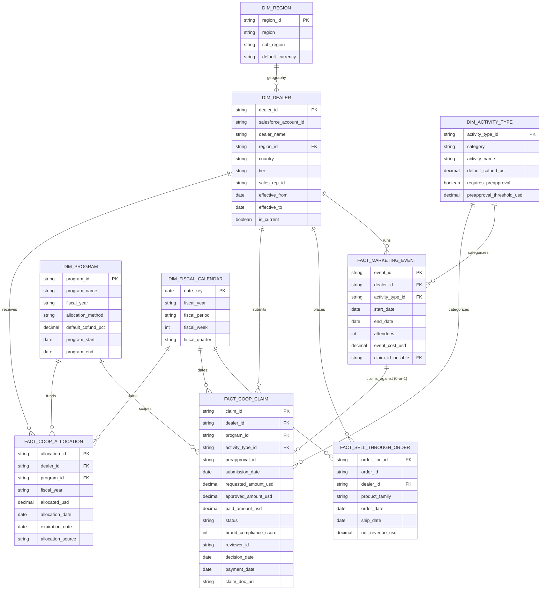
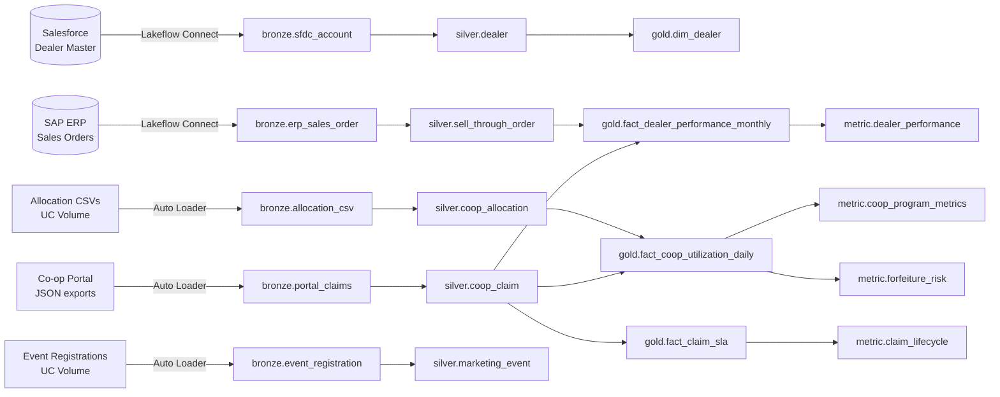

# COMPASS Demo — Data Model

This is the **logical and physical** data model for the Co-op Program Analytics Agent. It is the contract between the data engineer building the bronze/silver/gold pipeline and everyone else (Metric View author, Genie space owner, app developer).

UC layout:

```
catalog:   steelcase_demo
schemas:   bronze, silver, gold, metric, lakebase_sync
```

---

## 1. ERD (Mermaid)



---

## 2. Grain & cardinality

| Table | Grain | Approx rows (demo) |
|-------|-------|--------------------|
| `dim_dealer` | one row per dealer per SCD-2 effective period | ~900 (820 active + history) |
| `dim_program` | one row per program | 10 |
| `dim_activity_type` | one row per activity type | 22 |
| `dim_fiscal_calendar` | one row per day | ~1,100 (3 FY) |
| `dim_region` | one row per region | 8 |
| `fact_coop_allocation` | one row per allocation event | ~6,500 |
| `fact_coop_claim` | one row per claim | ~28,000 |
| `fact_sell_through_order` | one row per order line | ~480,000 |
| `fact_marketing_event` | one row per event | ~3,200 |

---

## 3. Column dictionary (selected)

### 3.1 `dim_dealer`
| Column | Type | Notes |
|--------|------|-------|
| `dealer_id` | STRING | Surrogate key, e.g. `D-04711` |
| `salesforce_account_id` | STRING | 18-char SFDC ID, source of truth from CDPP |
| `dealer_name` | STRING | "Pivot Workplace Solutions" |
| `region_id` | STRING | FK to `dim_region` |
| `country` | STRING | ISO-2 |
| `tier` | STRING | One of: `Platinum`, `Gold`, `Silver`, `Authorized` |
| `sales_rep_id` | STRING | Internal CRM rep ID |
| `effective_from` / `effective_to` | DATE | SCD-2 window |
| `is_current` | BOOLEAN | True for the live row |

### 3.2 `dim_program`
| Column | Type | Notes |
|--------|------|-------|
| `program_id` | STRING | `PRG-FY26-COOP-MAIN` |
| `program_name` | STRING | Human-friendly |
| `fiscal_year` | STRING | e.g. `FY26` (mar 2026 – feb 2027) |
| `allocation_method` | STRING | `tier_based`, `negotiated`, `performance` |
| `default_cofund_pct` | DECIMAL(5,2) | Steelcase share, e.g. 50.00 |
| `program_start`, `program_end` | DATE | |

### 3.3 `dim_activity_type`
| Column | Type | Notes |
|--------|------|-------|
| `activity_type_id` | STRING | `ACT-DIG-PROG-DISPLAY` |
| `category` | STRING | `Digital`, `Event`, `Showroom`, `Content`, `Sponsorship` |
| `activity_name` | STRING | "Programmatic Display" |
| `default_cofund_pct` | DECIMAL(5,2) | Activity-specific override |
| `requires_preapproval` | BOOLEAN | |
| `preapproval_threshold_usd` | DECIMAL(12,2) | If `requires_preapproval` only above this amount |

### 3.4 `fact_coop_allocation`
| Column | Type | Notes |
|--------|------|-------|
| `allocation_id` | STRING | PK |
| `dealer_id` | STRING | FK |
| `program_id` | STRING | FK |
| `fiscal_year` | STRING | Denormalized for partitioning |
| `allocated_usd` | DECIMAL(14,2) | Always positive |
| `allocation_date` | DATE | |
| `expiration_date` | DATE | Often = `program_end` |
| `allocation_source` | STRING | `initial`, `top_up`, `reallocation` |

### 3.5 `fact_coop_claim` (the most important table)
| Column | Type | Notes |
|--------|------|-------|
| `claim_id` | STRING | `CL-2026-AE-009842` |
| `dealer_id` | STRING | FK |
| `program_id` | STRING | FK |
| `activity_type_id` | STRING | FK |
| `preapproval_id` | STRING | Nullable; required for above-threshold activities |
| `submission_date` | DATE | |
| `requested_amount_usd` | DECIMAL(12,2) | What the dealer asked for |
| `approved_amount_usd` | DECIMAL(12,2) | Nullable until approved |
| `paid_amount_usd` | DECIMAL(12,2) | Nullable until paid |
| `status` | STRING | `Draft`, `Submitted`, `Under_Review`, `Approved`, `Rejected`, `Paid`, `Expired` |
| `brand_compliance_score` | INT | 0–100, from creative review |
| `reviewer_id` | STRING | Internal reviewer user ID |
| `decision_date` | DATE | Nullable |
| `payment_date` | DATE | Nullable |
| `claim_doc_uri` | STRING | Path in UC Volume to proof bundle |

State distribution (target for synthetic data, sums to 100%):
- Draft 5%, Submitted 8%, Under_Review 12%, Approved 25%, Rejected 8%, Paid 38%, Expired 4%

### 3.6 `fact_sell_through_order`
| Column | Type | Notes |
|--------|------|-------|
| `order_line_id` | STRING | PK |
| `order_id` | STRING | Order parent |
| `dealer_id` | STRING | FK |
| `product_family` | STRING | `Seating`, `Desks`, `Storage`, `Architecture`, `Accessories` |
| `order_date`, `ship_date` | DATE | |
| `net_revenue_usd` | DECIMAL(12,2) | |

### 3.7 `fact_marketing_event`
| Column | Type | Notes |
|--------|------|-------|
| `event_id` | STRING | PK |
| `dealer_id` | STRING | FK |
| `activity_type_id` | STRING | FK |
| `start_date`, `end_date` | DATE | |
| `attendees` | INT | |
| `event_cost_usd` | DECIMAL(12,2) | |
| `claim_id_nullable` | STRING | Link to claim if filed |

---

## 4. Gold-layer derived facts

### 4.1 `gold.fact_coop_utilization_daily`
Daily snapshot, one row per dealer × program × fiscal_period × date in the range.
Columns: `dealer_id`, `program_id`, `fiscal_period`, `date_key`, `allocated_usd`, `committed_usd`, `approved_usd`, `paid_usd`, `unused_usd`, `days_to_expiration`.
- `committed_usd` = sum of `requested_amount_usd` for claims in `(Submitted, Under_Review, Approved, Paid)`.
- `approved_usd` = sum of `approved_amount_usd` for claims in `(Approved, Paid)`.
- `paid_usd` = sum of `paid_amount_usd` for claims in `(Paid)`.
- `unused_usd` = `allocated_usd - committed_usd`.
- Materialized as a **Streaming Table** refreshing daily from silver.

### 4.2 `gold.fact_claim_sla`
One row per claim, with elapsed days per state transition.
Columns: `claim_id`, `dealer_id`, `region_id`, `tier`, `submission_date`, `days_submission_to_review`, `days_review_to_decision`, `days_decision_to_payment`, `total_cycle_days`, `first_pass_approval`.

### 4.3 `gold.fact_dealer_performance_monthly`
One row per dealer × month.
Columns: `dealer_id`, `month`, `net_revenue_usd`, `coop_paid_usd`, `attributed_coop_usd_lift`, `lift_vs_control_pct`.
- `attributed_coop_usd_lift` computed via matched-pair lift-vs-control (see `dealer_performance.yaml` for methodology).

### 4.4 `gold.dim_dealer`, `gold.dim_program`, `gold.dim_activity_type`, `gold.dim_fiscal_calendar`, `gold.dim_region`
Cleaned, current-only views of the silver dimensions, exposed to Genie.

---

## 5. Bronze → Silver → Gold lineage



---

## 6. Naming conventions

- Catalog: `steelcase_demo`
- Schemas: `bronze`, `silver`, `gold`, `metric`, `lakebase_sync`
- Tables: `snake_case`. Facts prefixed `fact_`, dimensions `dim_`.
- IDs: `<entity>_id`, surrogate STRING keys.
- Currency columns: always `_usd` suffix, `DECIMAL(p,2)`.
- Dates: `DATE`. Timestamps: `TIMESTAMP` in UTC.
- Booleans: `is_*`, `requires_*`.
- Status enums: `Pascal_Snake` to match source system (`Under_Review`).

---

## 7. Quality rules (enforced in pipeline)

| Rule | Where | Failure action |
|------|-------|----------------|
| `dealer_id` not null | all facts | Quarantine |
| `requested_amount_usd > 0` | claim | Quarantine |
| `paid_amount_usd <= approved_amount_usd` | claim, when status=Paid | Quarantine + alert |
| Sum of `allocated_usd` per dealer×fy = `allocation_csv` sum | reconciliation | Daily report |
| `status` transitions are monotonic | claim | Quarantine |
| `expiration_date >= allocation_date` | allocation | Quarantine |

---

## 8. Sensitive / governed columns

- `dim_dealer.salesforce_account_id` — masked from dealer-side users via UC column mask.
- `dim_dealer.sales_rep_id` — masked from dealer-side users.
- All revenue columns — restricted to `channel_marketing` and `finance` groups.
- Row-level filter on `dim_dealer.region_id` for regional channel managers (e.g., Maya only sees `AMER_EAST`).
